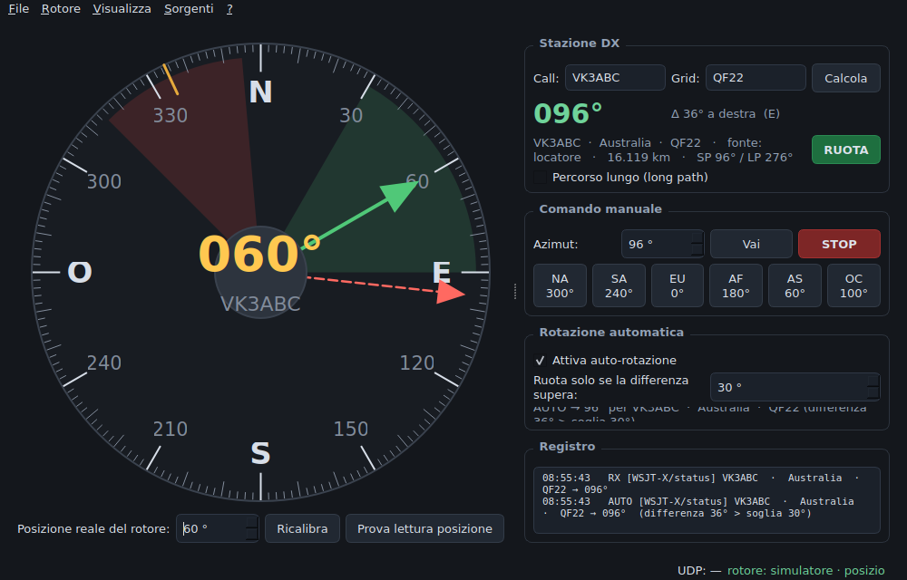

# DXRotator

[🇮🇹 Versione italiana](README.it.md)

Cross-platform rotator control (Windows · macOS · Linux) is currently tested only for macOS. It is for the **Hy-Gain
T2X / Ham-IV** via the **DCU-1 protocol**, driven by the DX station data that
**WSJT-X** and **N1MM+** broadcast over UDP.

Point your beam at the station you are working, automatically, without
leaving the keyboard.



## What it does

- Computes the great-circle bearing from the **Maidenhead locator** when the
  source provides one, and falls back to the **DXCC entity centre** derived
  from the callsign prefix.
- **Manual control**: type a call, click anywhere on the compass rose, use the
  continent presets, or enter a bearing.
- **Automatic rotation with a threshold**: the command is sent *only* when the
  difference between the rotator's position and the DX bearing exceeds N
  degrees (30° by default), so the antenna does not chase every decode.
- **Band filter**: acts only on the bands whose antenna is actually on the
  rotator. If you run a hexbeam on the mast and a vertical for the low bands,
  the rotator stays put while you work the vertical.
- **Mechanical stop model** with a configurable safety margin, so the beam is
  never commanded into the end stop.
- Compact window mode, for shacks where screen space is contested.
- Headless mode for a Raspberry Pi.

## Install

Python 3.9 or newer.

```bash
git clone https://github.com/jjleto/dxrotator.git
cd dxrotator
python3 -m venv .venv
source .venv/bin/activate          # Windows: .venv\Scripts\activate
pip install -r requirements.txt
python run_dxrotator.py
```

Standalone executable:

```bash
pip install pyinstaller
python build.py                    # result in dist/
```

On Linux you may need to join the serial group:
`sudo usermod -a -G dialout $USER` (Debian/Ubuntu) or `-G uucp` (Arch).

## Connecting the rotator

Default DCU-1 serial settings: **4800 baud, 8N1**.

| Command | Meaning |
|---------|---------|
| `AP1xxx;` | set target bearing (000–359) |
| `AM1;` | start rotation |
| `;` | stop |
| `AI1;` | read current bearing, replies `;xxx` — **not** on a genuine DCU-1, see below |

The brake has no command of its own: on `AM1;` the DCU-1 runs the whole
mechanical sequence by itself (release the wedge, counter-rotate a few
degrees, rotate, halve the speed for the last 5°, stop, wait 8 seconds, engage
the brake). Those 8 seconds let a large antenna coast to a stop — do not
machine-gun commands at it.

### Things learned the hard way

Real DCU-1 units are less obedient than the manual suggests. All of these are
configurable, because behaviour varies between units and clones:

- **Some units drop `AM1;` when it arrives glued to `AP1xxx;`.** The symptom is
  having to click "Go" twice. Send the two commands separately with a gap
  (default 0.15 s).
- **Some units ignore the `;` stop command entirely.** DXRotator offers four
  stop strategies; the gentlest one that works on such units is *set point
  only*: it sends `AP1<current position>;` with no `AM1;`, which stops the
  rotator without cycling the brake. The stop is also **repeated** a few times,
  because the controller discards commands received while it is busy with the
  start-up sequence.
- **`AM1;` is never sent when the rotator is already stopped**, or the brake
  would release for nothing.
- **Positioning is not exact.** Expect a few degrees of error from the
  potentiometer, a long control cable and the antenna's inertia. A constant
  bias is removed with the calibration offset; the residual scatter is why the
  safety margin from the mechanical stop matters.

### Position: read or estimated

**The genuine Hy-Gain DCU-1 does not report its position.** Its manual
documents `AP1xxx;` and `AM1;` only, and states: *"There are no provisions at
this time to send current bearing information back to the computer."*

`AI1;` is an extension of the controllers that **emulate** the DCU-1 — Idiom
Press Rotor-EZ, Green Heron RT-21 and similar. If you have one, press **Test
position readback** in the main window; if it answers, enable position reading
and the green needle becomes the real bearing, with an automatic stop if the
antenna enters the safety margin.

Otherwise DXRotator **estimates** the position by integrating the rotator's
nominal speed (6 °/s ≈ 60 s per turn on a T2X). The estimate does not drift
without bound: every new command resets it to the commanded bearing. Use
**Recalibrate** whenever you move the rotator from the controller's own knob.

### Mechanical stop

Enter the **true bearing of the end stop**, measured with a compass with the
antenna resting against it — not a nominal value.

- **180°** → stop at South, North at mid-travel ("north-centred", the standard
  Hy-Gain installation).
- **0°** → stop at North.
- Travel **450°** for rotators with overlap.

This matters more than it looks. With the stop at South, going from 350° to
10° costs 20° of rotation. With the stop at North the same move costs **340°**,
about 57 seconds. DXRotator accounts for it in the position estimate, in the
time estimate, and draws the stop as an amber tick on the dial.

The **safety margin** (10° by default) keeps a wedge around the stop
off-limits: commands falling inside it are clamped to the edge, on the side
you are approaching from, and the event is logged.

## Data sources

### WSJT-X

`File → Settings → Reporting → UDP Server`: point it at the machine running
DXRotator, port `2237`. Multicast addresses (e.g. `224.0.0.1`) work too — the
group is joined automatically.

- **Status** — the DX station selected in WSJT-X. This is the recommended
  source for automatic rotation: it changes only when you actually pick a
  correspondent. Clearing the DX Call field in WSJT-X clears DXRotator too.
- **Decode** — every decode. Useful to watch, unwise to automate.
- **QSO Logged** — on logging.

### N1MM+

`Config → Configure Ports → Broadcast Data`: Contacts and Spots to
`127.0.0.1:12060`, Rotor to `127.0.0.1:12040`.

From contacts and spots DXRotator takes the callsign and gridsquare and does
its own maths; from the rotor broadcast (`<N1MMRotor><rotor><goazi>`) it takes
the bearing N1MM already computed.

## Automatic rotation logic

```
1. work out the DX bearing
   ├─ bearing supplied by the source (N1MM rotor broadcast) → use it
   ├─ valid Maidenhead locator                              → great circle
   └─ otherwise prefix → DXCC entity → entity centre
2. band not enabled (antenna not on the rotator)  → do nothing
3. automatic rotation off                         → do nothing
4. less than N seconds since the last command     → do nothing
5. difference ≤ threshold (shortest angle)        → do NOT rotate
6. bearing inside the safety margin               → clamp to the edge
7. send AP1xxx; then AM1;
```

The threshold works on the shortest angular difference, so it behaves
correctly across North (350° vs 10° is 20°, not 340°).

Manual commands are never filtered: presets, compass clicks and the Go button
work on any band, because they are explicit operator decisions.

## Trying it without hardware

Leave the serial port empty to use the built-in simulator, then:

```bash
python tools/send_test.py wsjtx VK3ABC QF22     # WSJT-X Status
python tools/send_test.py decode "CQ JA1XYZ PM95"
python tools/send_test.py n1mm  ZL2ABC RE78     # N1MM contact
python tools/send_test.py rotor 275             # N1MM rotor broadcast
python tools/send_test.py demo                  # six stations around the globe
```

## Tests

```bash
python -m unittest discover -s tests -v
```

67 tests covering great-circle bearings against known references, Maidenhead
round-trips, DXCC resolution, mechanical-stop geometry, the safety margin, the
byte-level format of DCU-1 commands, the stop strategies, band classification
and the WSJT-X / N1MM packet decoders.

## Configuration file

| System | Path |
|--------|------|
| Windows | `%APPDATA%\DXRotator\config.json` |
| macOS | `~/Library/Application Support/DXRotator/config.json` |
| Linux | `~/.config/dxrotator/config.json` |

## Project layout

```
dxrotator/
├── geo.py        Maidenhead, great circle, angular helpers
├── bands.py      frequency → band, band filter
├── dxcc.py       cty.dat parser + built-in table, prefix → entity
├── rotor.py      DCU-1 protocol, transports, position estimate, stop logic
├── sources.py    WSJT-X (binary) and N1MM+ (XML) UDP decoders
├── engine.py     target → bearing → auto-rotation rules
├── config.py     JSON persistence
├── compass.py    compass rose widget
├── gui.py        main window and settings (PySide6)
└── headless.py   no-GUI mode
tools/send_test.py  WSJT-X / N1MM simulator
tests/test_all.py   test suite
```

## Contributing

Bug reports from the field are the most valuable thing here — most of what
makes this software work on real hardware came from somebody patiently
measuring what their controller actually did. When reporting, please include
the first line of the log (it carries the version and the mechanical stop
setting) and the log around the problem.


## Acknowledgements

Written by IW5DNZ, with Claude (Anthropic) as coding assistant.
The behaviour of the real DCU-1 documented here — dropped commands, the
ignored stop, the brake sequence, the positioning error — was measured on the
air, one reading at a time.

---

## License

MIT — see [LICENSE](LICENSE). No warranty: always check your rotator's end
stops before leaving automatic rotation unattended.

73!
